# 🚀 Stellar Ads SDK

A decentralized advertising platform with automated payments via Stellar Blockchain and Soroban Smart Contracts.

## 📋 Overview

**Decentralized** is a complete ecosystem of decentralized advertising that revolutionizes the digital market through:

- **Node.js/Express Backend** with endpoints to serve ads and track clicks
- **Lightweight JavaScript SDK** for seamless integration into publisher websites
- **Soroban Smart Contracts** for campaign management and automated payment distribution
- **Stellar Blockchain Integration** for transparent and low-cost transactions
- **SQLite Database** for local cache and real-time metrics
- **Oracle Verification System** for interaction validation and fraud prevention

### 🎯 Problems Solved

- **💰 High Costs**: Eliminates intermediaries, reducing costs by up to 40%
- **🔍 Lack of Transparency**: All transactions and metrics on the public blockchain
- **🛡️ Advertising Fraud**: Cryptographic verification prevents fake clicks and views
- **💸 Unfair Distribution**: Direct and automated payments to all parties
- **🔒 Privacy**: Contextual segmentation without collecting personal data

## 🏗️ System Architecture

### Overall Architecture View

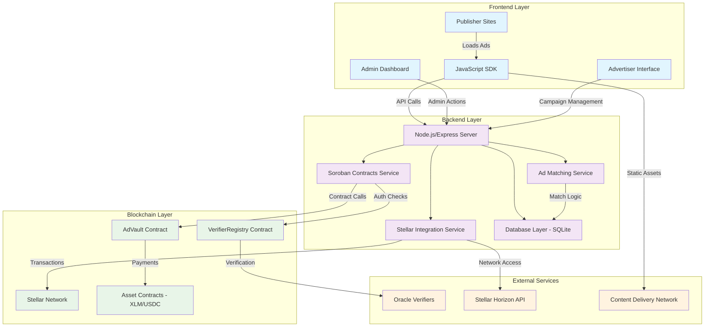

### Ad Interaction Flow

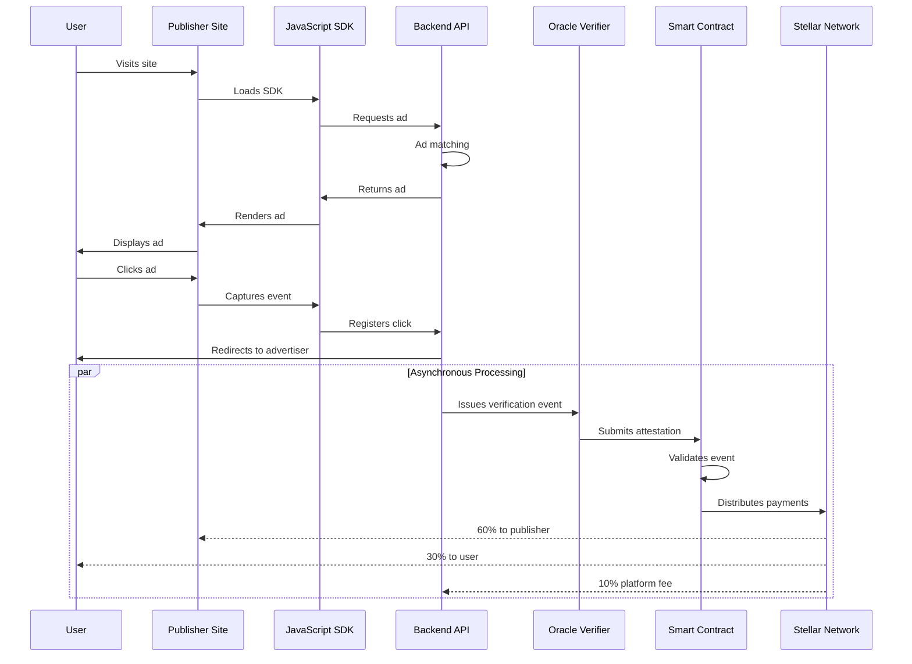

### Payment Distribution Flow

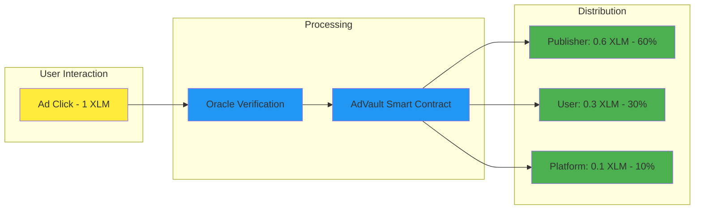

### Ecosystem Components

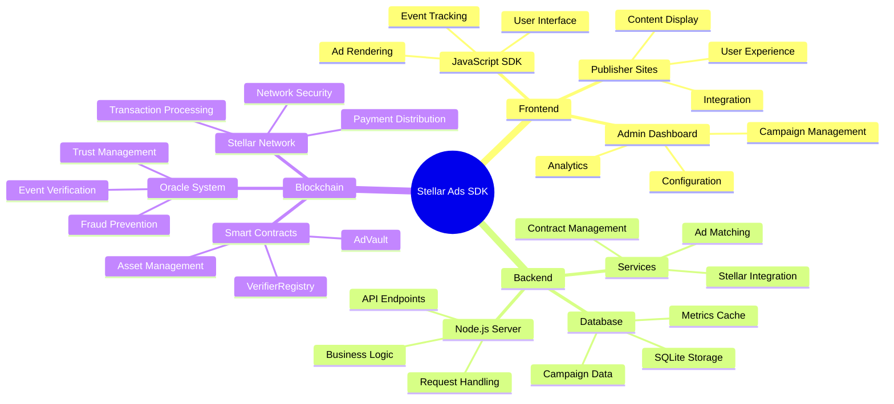

## 🎭 System Actors

### Actors Diagram

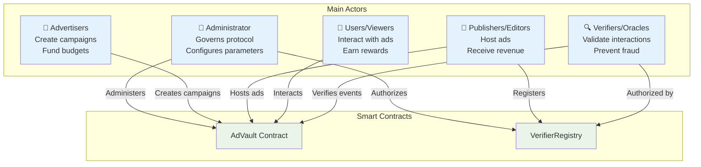

## 🚀 Quick Start

### Prerequisites

- Node.js 16+
- npm or yarn
- Stellar CLI (for smart contracts)
- Rust 1.70+ with `wasm32-unknown-unknown` target (for contract development)

### Installation and Setup

```bash
# 1. Clone the repository
git clone <your-repository>
cd sdk

# 2. Install dependencies
npm install

# 3. Configure environment variables
cp .env.example .env
# Edit the .env file with your Stellar configurations

# 4. Initialize database
npm run init-db

# 5. Start in development mode
npm run dev
```

### Smart Contracts Setup

```bash
# 1. Install Stellar CLI and Rust target
rustup target add wasm32-unknown-unknown
stellar version

# 2. Deploy contracts (optional, for advanced development)
cd stellar-contracts
./deploy-contracts.sh testnet

# 3. Configure contract addresses in .env
echo "ADVAULT_CONTRACT_ADDRESS=<contract-id>" >> ../.env
echo "VERIFIER_REGISTRY_ADDRESS=<contract-id>" >> ../.env
```

### Testing the Application

1. **Access the demo page:**

   ```
   http://localhost:3000
   ```

2. **Test API endpoints:**

   ```bash
   # Fetch ad
   curl "http://localhost:3000/api/ad?siteId=site_example_123"

   # View statistics
   curl "http://localhost:3000/api/stats"

   # Health check
   curl "http://localhost:3000/health"
   ```

## 💡 How to Integrate the SDK

### For Publishers (Website Owners)

#### Step 1: Add Container

```html
<!-- Container where the ad will be displayed -->
<div id="stellar-ad-container" style="width: 300px; height: 250px;"></div>
```

#### Step 2: Include the SDK

```html
<!-- Replace YOUR_SITE_ID with your actual ID -->
<script src="https://api.your-platform.com/sdk.js?siteId=YOUR_SITE_ID"></script>
```

#### Done!

The ad will load automatically. Clicks are tracked and payments processed via Stellar.

## 🛠️ Configuration

### Complete Environment Configuration

```bash
# === Server Configurations ===
PORT=3000
NODE_ENV=development
API_BASE_URL=http://localhost:3000
DATABASE_PATH=./database.sqlite

# === Stellar Network Configurations ===
STELLAR_NETWORK=testnet
STELLAR_HORIZON_URL=https://horizon-testnet.stellar.org
PLATFORM_SECRET_KEY=your_stellar_secret_key_here
PLATFORM_PUBLIC_KEY=your_stellar_public_key_here

# === Smart Contracts Addresses ===
ADVAULT_CONTRACT_ADDRESS=CDABCDEF1234567890ABCDEF1234567890ABCDEF1234567890ABCDEF12
VERIFIER_REGISTRY_ADDRESS=CABCDEF1234567890ABCDEF1234567890ABCDEF1234567890ABCDEF123
STELLAR_ASSET_CONTRACT_ADDRESS=native  # or USDC address

# === Payment Configurations ===
DEFAULT_PRICE_PER_EVENT=10000000  # 1 XLM in stroops
PUBLISHER_SHARE_BPS=6000          # 60%
VIEWER_REWARD_BPS=3000            # 30%
PLATFORM_FEE_BPS=1000             # 10%

# === URLs and CORS ===
DEFAULT_CLICK_REDIRECT_URL=https://example.com
CORS_ORIGIN=*

# === Security Configurations ===
RATE_LIMIT_WINDOW_MS=900000       # 15 minutes
RATE_LIMIT_MAX_REQUESTS=100       # max per window
ENABLE_FRAUD_DETECTION=true

# === Cache Configurations ===
CACHE_TTL_SECONDS=300             # 5 minutes
ENABLE_REDIS_CACHE=false          # use Redis in production
```

### Stellar Blockchain

1. **For development (Testnet):**

   - Use `STELLAR_NETWORK=testnet`
   - Create test accounts at: https://laboratory.stellar.org/

2. **For production (Mainnet):**
   - Use `STELLAR_NETWORK=mainnet`
   - Configure real Stellar keys

## 📚 Complete API Reference

### APIs Architecture

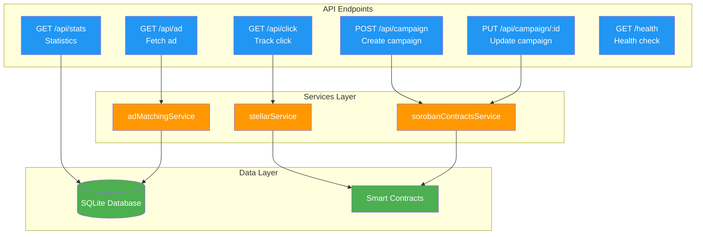

### Main Endpoints

#### `GET /api/ad` - Fetch Ad

Fetches optimized ad for a specific site using matching algorithms.

**Query Parameters:**
- `siteId` (required): Unique site identifier
- `category` (optional): Content category for targeting
- `userLocation` (optional): Location for geo-targeting
- `format` (optional): Ad format (banner, video, native)

**Headers:**
- `User-Agent`: Browser identification
- `Accept-Language`: Preferred language
- `X-Publisher-Token`: Publisher authentication token (optional)

**Success Response (200):**
```json
{
  "success": true,
  "ad": {
    "campaignId": "campaign_tech_001",
    "advertiserName": "TechStartup Inc",
    "adTitle": "Revolutionize your business",
    "adDescription": "Innovative solution for companies",
    "imageUrl": "https://cdn.example.com/ads/tech-startup-banner.jpg",
    "clickUrl": "https://api.stellarads.com/api/click?campaignId=campaign_tech_001&siteId=site_example_123",
    "costPerClick": 0.1,
    "format": "banner",
    "dimensions": {
      "width": 728,
      "height": 90
    },
    "targetingInfo": {
      "category": "technology",
      "keywords": ["innovation", "startup", "technology"],
      "geoTarget": ["BR", "PT"]
    }
  },
  "metadata": {
    "requestId": "req_1632847291_abc123",
    "timestamp": 1632847291,
    "cacheTtl": 300
  }
}
```

**Error Response (400/404):**
```json
{
  "success": false,
  "error": {
    "code": "INVALID_SITE_ID",
    "message": "Site ID not found or invalid",
    "details": {
      "providedSiteId": "invalid_site",
      "validationErrors": ["Site must be registered and active"]
    }
  }
}
```

#### `GET /api/click` - Track Click and Process Payment

Registers user interaction and processes payment via smart contracts.

**Query Parameters:**
- `campaignId` (required): Campaign ID
- `siteId` (required): Site ID
- `userId` (optional): Anonymous user ID
- `eventType` (optional): Event type (click, view, conversion)

**Headers:**
- `User-Agent`: For bot detection
- `Referer`: Origin validation
- `X-Real-IP`: End user IP

**Processing Flow:**
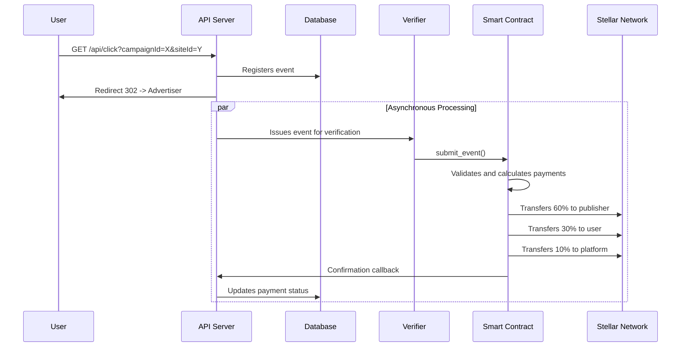

**Response:**
- **302 Redirect**: To advertiser's destination URL
- **Additional Headers**: `X-Payment-Status: processing`

#### `GET /api/stats` - Statistics and Metrics

Returns aggregated metrics from the platform in real-time.

**Query Parameters:**
- `period` (optional): Aggregation period (1h, 24h, 7d, 30d)
- `siteId` (optional): Filter by specific site
- `campaignId` (optional): Filter by specific campaign

**Response:**
```json
{
  "success": true,
  "stats": {
    "overview": {
      "totalClicks": 15847,
      "totalImpressions": 284691,
      "totalRevenue": 1584.7,
      "activeCampaigns": 23,
      "activeSites": 12,
      "averageCTR": 5.57,
      "averageCPC": 0.10
    },
    "period": {
      "from": "2025-09-15T00:00:00Z",
      "to": "2025-09-16T00:00:00Z",
      "clicks": 1247,
      "impressions": 22831,
      "revenue": 124.7
    },
    "topCampaigns": [
      {
        "campaignId": "campaign_tech_001",
        "clicks": 523,
        "revenue": 52.3,
        "ctr": 6.2
      }
    ],
    "topPublishers": [
      {
        "siteId": "site_news_portal_001",
        "clicks": 892,
        "revenue": 89.2,
        "share": 62.44
      }
    ],
    "recentTransactions": [
      {
        "txHash": "abc123def456...",
        "amount": "1000000",
        "recipient": "GDAI...",
        "type": "publisher_payment",
        "timestamp": 1632847291
      }
    ]
  }
}
```

### Campaign Management APIs

#### `POST /api/campaign` - Create New Campaign

**Request Body:**
```json
{
  "advertiser": "GAIDAIDAIDAIDAIDAIDAIDAIDAIDAIDAIDAIDAIDAIDAIDAIDAIDAIDAI",
  "name": "Q4 2025 Campaign",
  "description": "Year-end promotion",
  "targetAudience": {
    "categories": ["technology", "business"],
    "geoTargets": ["BR", "PT", "US"],
    "ageRange": [25, 45],
    "languages": ["pt", "en"]
  },
  "creativeAssets": {
    "images": [
      {
        "url": "https://cdn.example.com/banner-728x90.jpg",
        "dimensions": [728, 90],
        "format": "banner"
      }
    ],
    "headlines": ["Main Headline", "Alternative Headline"],
    "descriptions": ["Detailed product description"]
  },
  "budget": {
    "total": 1000,
    "dailyLimit": 50,
    "bidAmount": 0.15
  },
  "schedule": {
    "startDate": "2025-09-20T00:00:00Z",
    "endDate": "2025-12-31T23:59:59Z",
    "timezone": "America/Sao_Paulo"
  }
}
```

#### `PUT /api/campaign/:id` - Update Campaign

Allows modifying parameters of active campaigns.

### Verification and Oracle APIs

#### `POST /api/verifier/register` - Register Verifier

**Authentication:** Admin only

```json
{
  "verifierAddress": "GVER...",
  "name": "Oracle Service Provider",
  "endpoint": "https://oracle.example.com/webhook",
  "publicKey": "...",
  "reputation": 100,
  "stakingAmount": 1000
}
```

## 📁 Detailed Project Structure

```
sdk/
├── 📄 index.js                          # Main Express server
├── 📄 package.json                      # NPM dependencies and scripts
├── 📄 README.md                         # Project documentation
├── 📄 LICENSE                           # MIT License
├── 📄 SDK_DEPENDENCIES.md               # Dependencies documentation
├── 📄 .env.example                      # Environment template
├── 📄 .gitignore                        # Git ignored files
│
├── 📁 src/                              # Backend source code
│   ├── 📁 models/
│   │   └── 📄 database.js               # SQLite schema and DB operations
│   ├── 📁 routes/
│   │   ├── 📄 adRoutes.js              # Ad and click routes
│   │   ├── 📄 campaignRoutes.js        # Campaign management
│   │   └── 📄 adminRoutes.js           # Administrative routes
│   ├── 📁 services/
│   │   ├── 📄 adMatchingService.js     # Matching algorithms
│   │   ├── 📄 stellarService.js        # Stellar Network integration
│   │   ├── 📄 sorobanContractsService.js # Soroban smart contracts
│   │   ├── 📄 fraudDetectionService.js # Fraud detection
│   │   └── 📄 cacheService.js          # Cache system
│   ├── 📁 middleware/
│   │   ├── 📄 authMiddleware.js        # Authentication and authorization
│   │   ├── 📄 rateLimitMiddleware.js   # Request limiting
│   │   └── 📄 validationMiddleware.js  # Data validation
│   ├── 📁 utils/
│   │   ├── 📄 logger.js                # Logging system
│   │   ├── 📄 errorHandler.js          # Error handling
│   │   └── 📄 helpers.js               # Utility functions
│   └── 📁 config/
│       ├── 📄 stellar.js               # Stellar configurations
│       ├── 📄 database.js              # Database configurations
│       └── 📄 app.js                   # Application configurations
│
├── 📁 public/                           # Static files and SDK
│   ├── 📄 sdk.js                       # Main JavaScript SDK
│   ├── 📄 index.html                   # Demo page
│   ├── 📄 news-site.html               # News site demo
│   ├── 📄 rewards-demo.html            # Rewards system demo
│   ├── 📄 gerador-sdk.html             # SDK generator
│   ├── 📄 teste-sdk-atualizado.html    # SDK tests
│   ├── 📁 css/
│   │   ├── 📄 sdk.css                  # SDK styles
│   │   └── 📄 demo.css                 # Demo styles
│   ├── 📁 js/
│   │   ├── 📄 analytics.js             # Client-side analytics
│   │   └── 📄 utils.js                 # JavaScript utilities
│   └── 📁 assets/
│       ├── 📁 images/                  # Example images
│       └── 📁 icons/                   # Interface icons
│
├── 📁 stellar-contracts/                # Soroban smart contracts
│   ├── 📄 Cargo.toml                   # Rust workspace
│   ├── 📄 README.md                    # Contract docs
│   ├── 📁 advault/                     # Main contract
│   │   ├── 📄 Cargo.toml
│   │   └── 📁 src/
│   │       └── 📄 lib.rs               # AdVault logic
│   ├── 📁 verifier_registry/           # Verifier registry
│   │   ├── 📄 Cargo.toml
│   │   └── 📁 src/
│   │       └── 📄 lib.rs               # VerifierRegistry logic
│   ├── 📁 scripts/
│   │   ├── 📄 deploy-contracts.sh      # Automated deployment
│   │   ├── 📄 test_advault.sh          # Comprehensive tests
│   │   └── 📄 test_payment_distribution.sh # Payment tests
│   └── 📁 target/                      # Compiled artifacts
│       └── 📁 wasm32-unknown-unknown/
│           └── 📁 release/
│               ├── 📄 advault.wasm
│               └── 📄 verifier_registry.wasm
│
├── 📁 tests/                           # Automated tests
│   ├── 📁 unit/
│   │   ├── 📄 adMatching.test.js
│   │   ├── 📄 stellarService.test.js
│   │   └── 📄 database.test.js
│   ├── 📁 integration/
│   │   ├── 📄 api.test.js
│   │   └── 📄 sdk.test.js
│   └── 📁 e2e/
│       └── 📄 fullFlow.test.js
│
├── 📁 docs/                            # Technical documentation
│   ├── 📄 api-reference.md
│   ├── 📄 sdk-integration-guide.md
│   ├── 📄 smart-contracts.md
│   ├── 📄 deployment-guide.md
│   └── 📁 diagrams/
│       ├── 📄 architecture.mmd
│       └── 📄 payment-flow.mmd
│
├── 📁 deployment/                      # Deployment configurations
│   ├── 📄 Dockerfile
│   ├── 📄 docker-compose.yml
│   ├── 📄 kubernetes.yml
│   └── 📁 scripts/
│       ├── 📄 build.sh
│       └── 📄 deploy.sh
│
└── 📁 database/                        # Database
    ├── 📄 database.sqlite              # Main SQLite database
    ├── 📁 migrations/
    │   ├── 📄 001_initial_schema.sql
    │   ├── 📄 002_add_campaigns.sql
    │   └── 📄 003_add_analytics.sql
    └── 📁 seeds/
        ├── 📄 dev_campaigns.sql
        └── 📄 test_data.sql
```

### Main Components

#### 🔧 Backend Services

| Component | Responsibility | Technology |
|------------|----------------|------------|
| **adMatchingService.js** | Ad matching algorithms | Node.js + Basic ML |
| **stellarService.js** | Stellar Network integration | Stellar SDK |
| **sorobanContractsService.js** | Smart contract interface | Soroban SDK |
| **fraudDetectionService.js** | Fraud detection and bots | Heuristics + ML |
| **cacheService.js** | In-memory and Redis cache | Memory/Redis |

#### 🎯 JavaScript SDK

| File | Function | Size |
|------|----------|------|
| **sdk.js** | Main SDK - loading and rendering | ~12KB |
| **analytics.js** | Event tracking | ~3KB |
| **utils.js** | Client-side utilities | ~2KB |

#### 🔐 Smart Contracts

| Contract | Main Function | Language |
|----------|---------------|----------|
| **AdVault** | Campaign and payment management | Rust + Soroban |
| **VerifierRegistry** | Verifier authorization | Rust + Soroban |

## 🔧 NPM Scripts

```bash
# Development with auto-reload
npm run dev

# Production
npm start

# Tests (to be implemented)
npm test
```

## 💰 Economy and Payment Distribution

### Economic Model

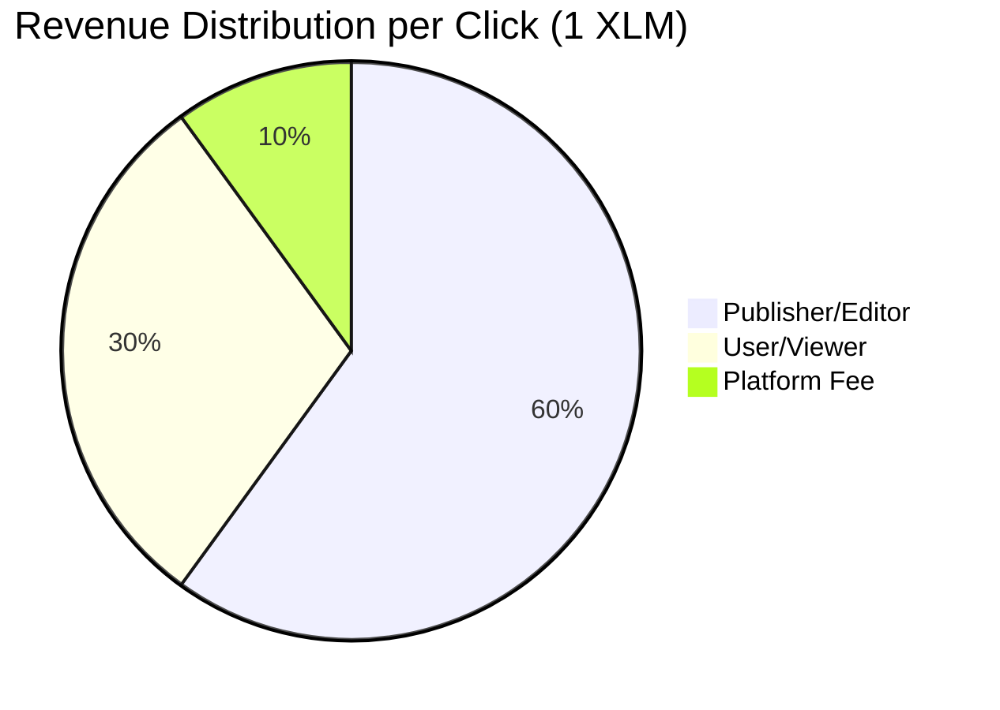

### Stellar Transaction Flow

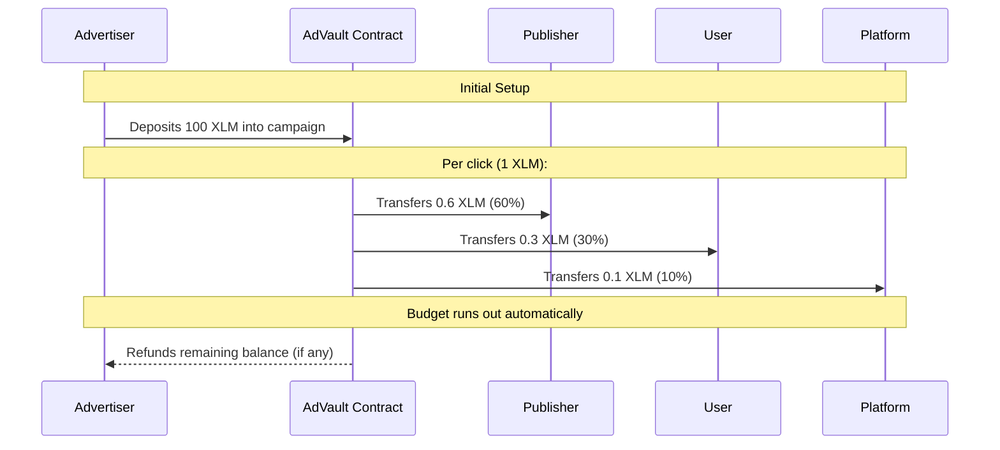

### Cost Structure

| Cost Type | Value | Responsible | Notes |
|-----------|-------|-------------|-------|
| **Stellar Network Fee** | ~0.00001 XLM | Transaction initiator | Minimal cost per transaction |
| **Contract Storage** | ~0.5 XLM one-time | Contract deployer | One-time creation fee |
| **Event Processing** | Configurable | Defined in contract | Default: 1 XLM per click |
| **Platform Fee** | 10% of value | Automatically retained | For maintenance and development |

### Supported Tokens

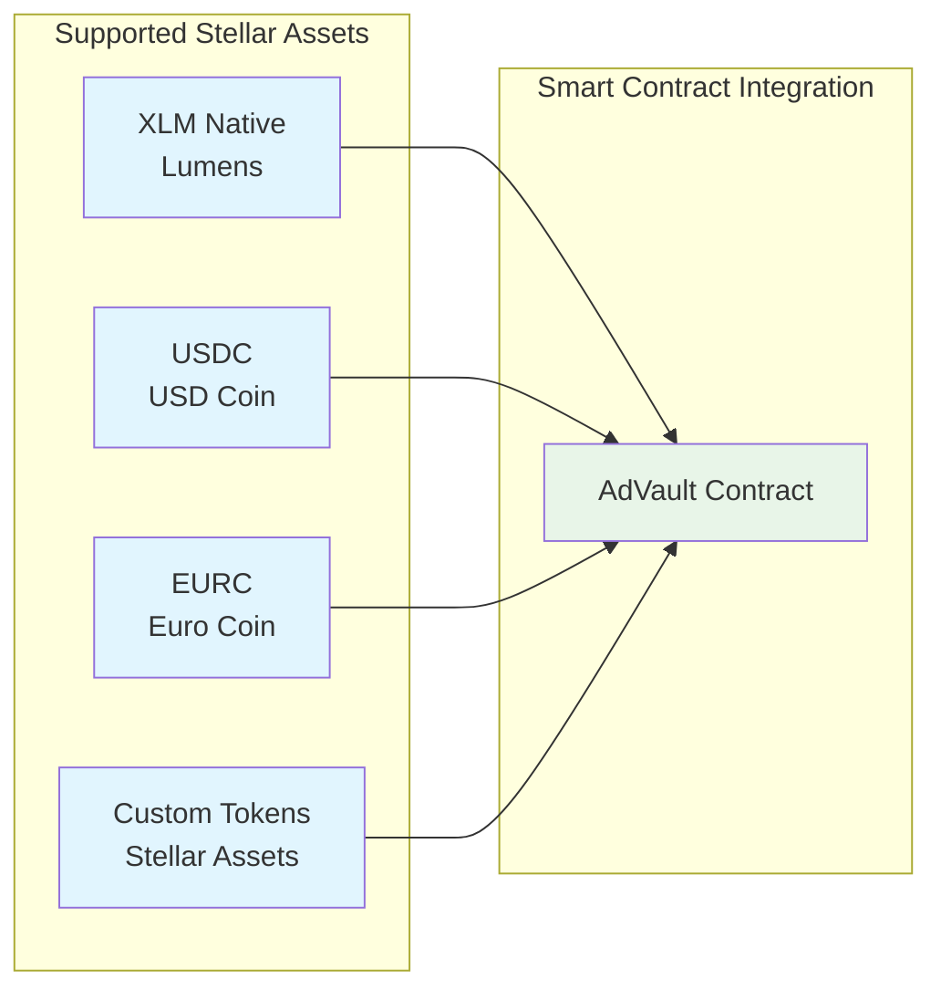

## 📊 Monitoring and Analytics

### Metrics Dashboard

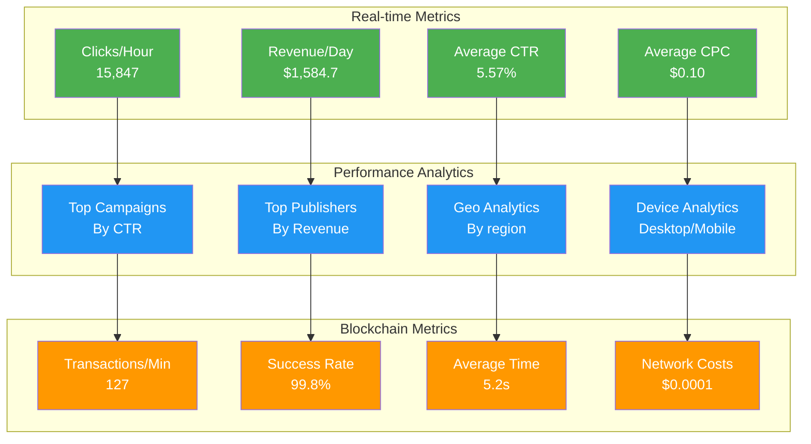

### Logging System

The system generates structured logs for:

#### 📈 Business Metrics
- **Ad requests**: Origin, category, result
- **Registered clicks**: Timestamp, publisher, campaign
- **Processed payments**: Amount, recipients, transaction hash
- **Conversions**: Campaign objective tracking

#### 🔍 Technical Metrics
- **API performance**: Response time, throughput
- **Errors and exceptions**: Stack traces, failure context
- **Resource usage**: CPU, memory, DB connections
- **Stellar network**: Connection status, latency

#### 🚨 Security Alerts
- **Fraud attempts**: Suspicious IPs, anomalous patterns
- **Rate limiting**: Blocked clients, traffic spikes
- **Authentication failures**: Invalid attempts
- **Smart contract anomalies**: Rejected transactions

### Metrics Available via API

```javascript
// GET /api/stats?period=24h&detailed=true
{
  "performance": {
    "totalRequests": 50847,
    "avgResponseTime": 125,
    "errorRate": 0.02,
    "throughputRpm": 847
  },
  "business": {
    "totalClicks": 15847,
    "totalRevenue": 1584.7,
    "activeCampaigns": 23,
    "activeSites": 12,
    "conversionRate": 2.3
  },
  "blockchain": {
    "totalTransactions": 15847,
    "successRate": 99.8,
    "avgConfirmationTime": 5.2,
    "networkCostTotal": 0.158
  },
  "fraud": {
    "suspiciousClicks": 47,
    "blockedIPs": 12,
    "botDetections": 234,
    "fraudRate": 0.003
  }
}
```

## 🛡️ Security and Fraud Prevention

### Security Architecture

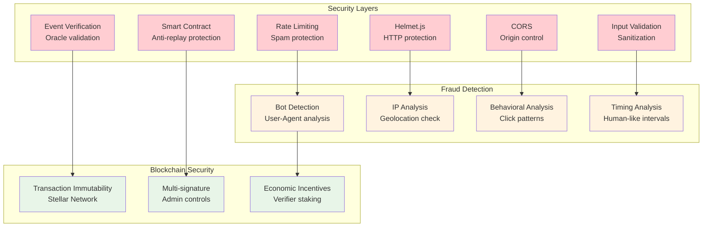

### Implemented Measures

#### 🔒 Application Security

- **Helmet.js**: Protection against common HTTP vulnerabilities
- **CORS**: Strict origin control
- **Rate Limiting**: DDoS and spam protection
- **Input Validation**: Sanitization of all input data
- **Secure Logging**: Activity tracking without exposing sensitive data

#### 🤖 Fraud Detection

- **User-Agent Analysis**: Bot and scraper detection
- **IP Verification**: Geographic analysis and blacklist
- **Behavioral Patterns**: Artificial click detection
- **Timing Analysis**: Human-like interval verification
- **Fingerprinting**: Unique device identification

#### ⛓️ Blockchain Security

- **Immutable Transactions**: All transactions recorded on blockchain
- **Oracle Verification**: Independent event validation
- **Anti-Replay Protection**: Prevention of duplicate events
- **Access Control**: Authorization based on smart contracts

### Verifiers System (Oracles)

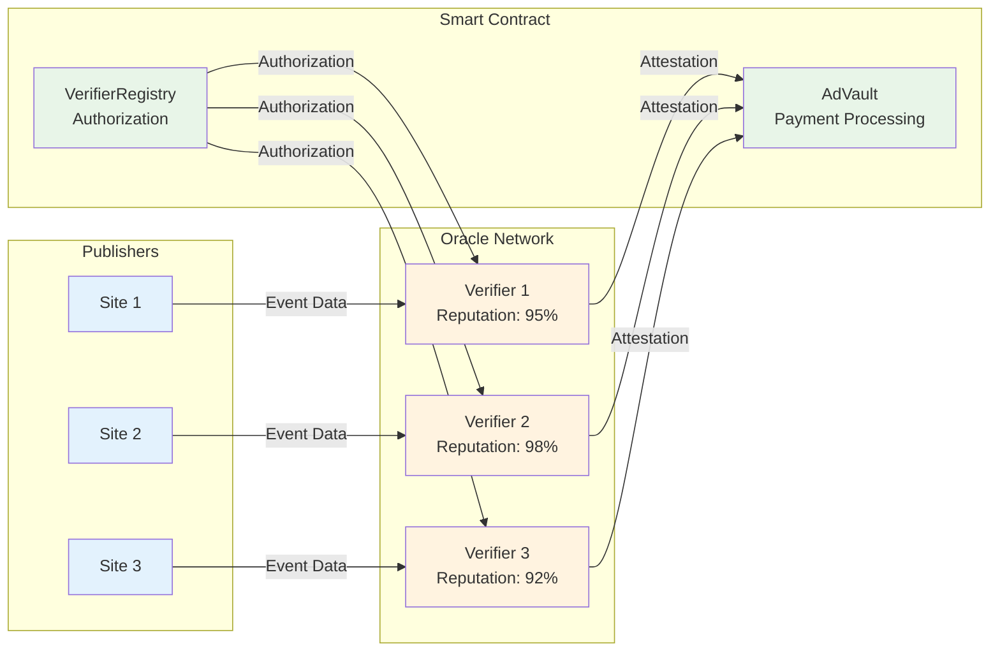

### Configurable Security Parameters

| Parameter | Default Value | Description |
|-----------|----------------|-------------|
| **RATE_LIMIT_WINDOW_MS** | 900000 (15 min) | Time window for rate limiting |
| **RATE_LIMIT_MAX_REQUESTS** | 100 | Max requests per window |
| **MIN_TIME_BETWEEN_CLICKS** | 1000ms | Minimum interval between clicks |
| **MAX_CLICKS_PER_USER_DAILY** | 100 | Daily limit per user |
| **ENABLE_BOT_DETECTION** | true | Bot detection activation |
| **REQUIRE_VERIFIER_CONSENSUS** | false | Require consensus from multiple verifiers |

## 🚀 Deployment and Operations

### Deployment Environments

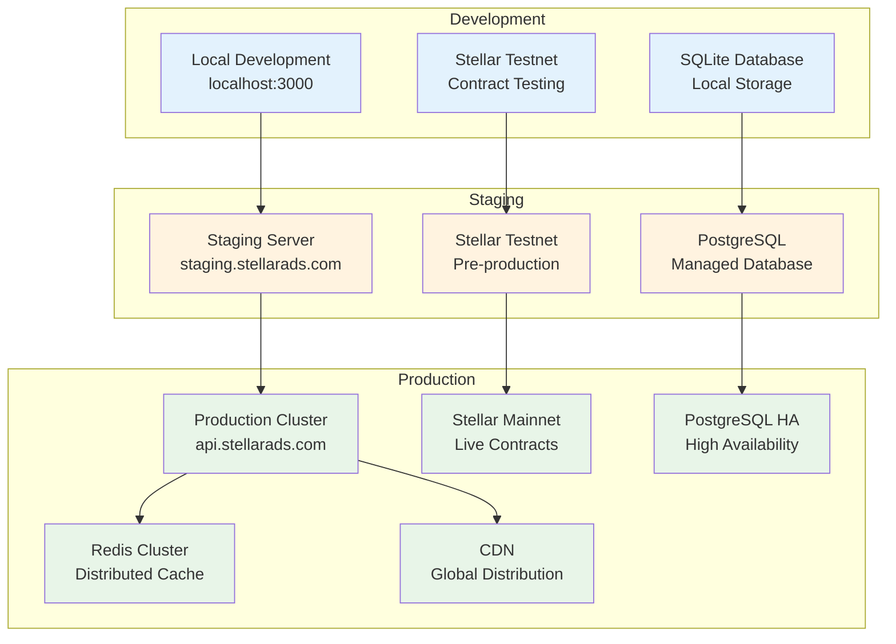

### Local Development

```bash
# Complete environment setup
npm run dev:setup

# Start with hot-reload
npm run dev

# Run tests
npm run test

# Lint and formatting
npm run lint:fix
```

### Staging Deployment

```bash
# Build application
npm run build

# Deploy to staging
npm run deploy:staging

# Run integration tests
npm run test:integration

# Check health checks
curl https://staging.stellarads.com/health
```

### Production Deployment

```bash
# Full deployment
./scripts/deploy-production.sh

# Post-deployment verification
./scripts/health-check.sh

# Rollback if necessary
./scripts/rollback.sh
```

### Production Configurations

#### Docker Configuration

```dockerfile
FROM node:18-alpine AS builder
WORKDIR /app
COPY package*.json ./
RUN npm ci --only=production

FROM node:18-alpine AS runtime
WORKDIR /app
COPY --from=builder /app/node_modules ./node_modules
COPY . .

EXPOSE 3000
HEALTHCHECK --interval=30s --timeout=10s --start-period=60s --retries=3 \
  CMD curl -f http://localhost:3000/health || exit 1

CMD ["npm", "start"]
```

#### Kubernetes Deployment

```yaml
apiVersion: apps/v1
kind: Deployment
metadata:
  name: stellar-ads-sdk
spec:
  replicas: 3
  selector:
    matchLabels:
      app: stellar-ads-sdk
  template:
    metadata:
      labels:
        app: stellar-ads-sdk
    spec:
      containers:
      - name: stellar-ads-sdk
        image: stellarads/sdk:latest
        ports:
        - containerPort: 3000
        env:
        - name: NODE_ENV
          value: "production"
        - name: STELLAR_NETWORK
          value: "mainnet"
        resources:
          requests:
            memory: "256Mi"
            cpu: "250m"
          limits:
            memory: "512Mi"
            cpu: "500m"
        livenessProbe:
          httpGet:
            path: /health
            port: 3000
          initialDelaySeconds: 60
          periodSeconds: 30
        readinessProbe:
          httpGet:
            path: /health
            port: 3000
          initialDelaySeconds: 10
          periodSeconds: 5
```

## 🔄 Roadmap and Evolution

### Development Roadmap

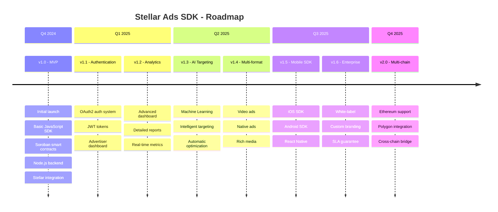

### Planned Features

#### 🔮 Next Versions (2025)

**v1.1 - Authentication System**
- [ ] OAuth2 integration with Google, GitHub
- [ ] JWT tokens for API authentication
- [ ] Web dashboard for advertisers
- [ ] Campaign management via interface
- [ ] Granular permissions system

**v1.2 - Advanced Analytics**
- [ ] Real-time dashboard with WebSocket
- [ ] Customizable reports
- [ ] Data export (CSV, PDF, Excel)
- [ ] Automated alerts
- [ ] Google Analytics integration

**v1.3 - Intelligent Targeting**
- [ ] Machine Learning for optimization
- [ ] Behavioral segmentation
- [ ] Lookalike audiences
- [ ] A/B testing automation
- [ ] Conversion prediction

**v1.4 - Advanced Formats**
- [ ] Video ads (MP4, WebM)
- [ ] Integrated native ads
- [ ] Interactive rich media
- [ ] AR/VR ad experiences
- [ ] Stories format

#### 🚀 Long-term Vision (2026+)

**v1.5 - Mobile Ecosystem**
- [ ] Native iOS SDK (Swift)
- [ ] Native Android SDK (Kotlin)
- [ ] React Native integration
- [ ] Flutter plugin
- [ ] Progressive Web Apps

**v1.6 - Enterprise Features**
- [ ] White-label solutions
- [ ] Complete custom branding
- [ ] Guaranteed SLA (99.9% uptime)
- [ ] 24/7 dedicated support
- [ ] GDPR/CCPA compliance

**v2.0 - Multi-Blockchain**
- [ ] Ethereum smart contracts
- [ ] Polygon integration
- [ ] Avalanche support
- [ ] Cross-chain bridge
- [ ] DeFi yield farming

### Future Architecture

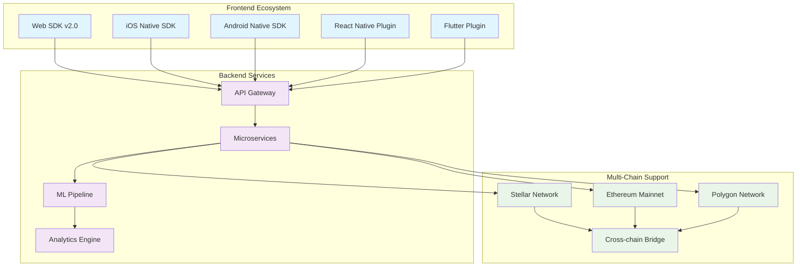

## 🤝 Contribution and Development

### Contributor Guidelines

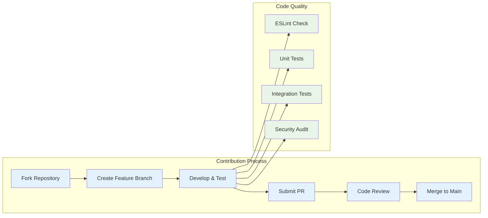

### Development Environment Setup

```bash
# 1. Clone and install
git clone https://github.com/your-user/stellar-ads-sdk.git
cd stellar-ads-sdk
npm install

# 2. Configure Git hooks
npm run prepare  # Installs husky hooks

# 3. Configure environment
cp .env.example .env.development
# Edit .env.development with your configurations

# 4. Run in development mode
npm run dev:all  # Backend + Frontend + Contracts

# 5. Run tests
npm run test:all  # Unit + Integration + E2E
```

### Code Standards

#### 🎯 Conventions

- **Commits**: Use [Conventional Commits](https://conventionalcommits.org/)
  ```bash
  feat: add video ads support
  fix: correct payment system bug
  docs: update API documentation
  test: add fraud detection tests
  ```

- **Branching**: Simplified GitFlow
  ```bash
  main              # Production
  develop           # Development
  feature/name      # New features
  hotfix/name       # Urgent fixes
  ```

- **Code Style**: ESLint + Prettier
  ```bash
  npm run lint      # Check style
  npm run lint:fix  # Fix automatically
  npm run format    # Format code
  ```

#### 📋 PR Checklist

- [ ] **Code**
  - [ ] Code follows ESLint/Prettier standards
  - [ ] Variable and function names are descriptive
  - [ ] Code is commented when necessary
  - [ ] No abandoned debug/comment code

- [ ] **Tests**
  - [ ] New features have unit tests
  - [ ] Integration tests pass
  - [ ] Code coverage maintained >80%
  - [ ] E2E tests pass (if applicable)

- [ ] **Documentation**
  - [ ] README updated if necessary
  - [ ] API documentation updated
  - [ ] Changelog updated
  - [ ] Code comments updated

- [ ] **Security**
  - [ ] No hardcoded secrets
  - [ ] Inputs are validated
  - [ ] Dependencies audited
  - [ ] Rate limiting considered

### Test Structure

```bash
tests/
├── unit/                    # Unit tests
│   ├── services/
│   │   ├── adMatching.test.js
│   │   ├── stellarService.test.js
│   │   └── fraudDetection.test.js
│   ├── models/
│   │   └── database.test.js
│   └── utils/
│       └── helpers.test.js
├── integration/             # Integration tests
│   ├── api/
│   │   ├── adRoutes.test.js
│   │   └── campaignRoutes.test.js
│   ├── blockchain/
│   │   └── contracts.test.js
│   └── database/
│       └── migrations.test.js
├── e2e/                     # End-to-end tests
│   ├── fullFlow.test.js
│   ├── paymentFlow.test.js
│   └── fraudPrevention.test.js
└── fixtures/                # Test data
    ├── campaigns.json
    ├── sites.json
    └── transactions.json
```

## 📞 Support and Resources

### Support Channels

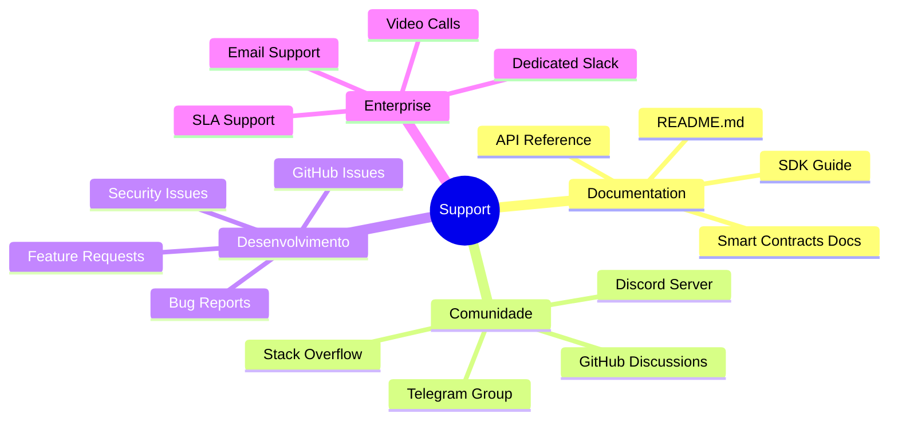

### Learning Resources

#### 📚 Official Documentation
- **[Stellar Developer Docs](https://developers.stellar.org/)** - Official Stellar documentation
- **[Soroban Docs](https://soroban.stellar.org/)** - Soroban smart contracts
- **[SDK Integration Guide](./docs/sdk-integration-guide.md)** - Integration guide
- **[API Reference](./docs/api-reference.md)** - Complete API documentation

#### 🎥 Tutorials and Examples
- **[Video Tutorials](https://youtube.com/stellarads)** - YouTube channel
- **[Code Examples](./examples/)** - Practical examples
- **[Integration Templates](./templates/)** - Ready templates
- **[Best Practices](./docs/best-practices.md)** - Best practices

#### 🛠️ Development Tools
- **[Stellar Laboratory](https://laboratory.stellar.org/)** - Testnet playground
- **[Stellar Expert](https://stellar.expert/)** - Block explorer
- **[SDK Debug Tool](https://debug.stellarads.com/)** - SDK debugging
- **[Contract Inspector](https://contracts.stellarads.com/)** - Contract inspection

### FAQ - Frequently Asked Questions

#### 🔧 Technical Integration

**Q: How to integrate SDK in React/Vue/Angular?**
```javascript
// React Example
import { useEffect } from 'react';

function AdComponent({ siteId }) {
  useEffect(() => {
    const script = document.createElement('script');
    script.src = `https://api.stellarads.com/sdk.js?siteId=${siteId}`;
    script.async = true;
    document.head.appendChild(script);
    
    return () => document.head.removeChild(script);
  }, [siteId]);

  return <div id="stellar-ad-container" style={{ width: 300, height: 250 }} />;
}
```

**Q: How to configure for production?**
```bash
# Minimum configurations for production
NODE_ENV=production
STELLAR_NETWORK=mainnet
DATABASE_PATH=./prod-database.sqlite
PLATFORM_SECRET_KEY=your_production_secret_key
```

**Q: How to monitor performance?**
```javascript
// Health check endpoint
fetch('/health')
  .then(res => res.json())
  .then(data => {
    console.log('Status:', data.status);
    console.log('Uptime:', data.uptime);
    console.log('Database:', data.database);
  });
```

#### 💰 Payments and Economy

**Q: How do payments work?**
- Payments are processed automatically via smart contracts
- 60% goes to publisher, 30% to user, 10% to platform
- Transactions are confirmed in ~5 seconds on Stellar network

**Q: Which tokens are supported?**
- XLM (Lumens) - Stellar native token
- USDC - USD Coin on Stellar network
- Any Stellar asset with sufficient liquidity

**Q: How to configure custom prices?**
```bash
# Configuration via smart contract
stellar contract invoke --id <CONTRACT> -- set_price_per_event \
  --new_price 5000000  # 0.5 XLM in stroops
```

#### 🛡️ Security and Fraud

**Q: How does the system prevent fraud?**
- User-Agent and behavior analysis
- IP verification and geolocation
- Independent oracle validation of events
- Smart contracts prevent replay attacks

**Q: How to report suspicious activity?**
- Via GitHub Issues with `security` label
- Direct email: security@stellarads.com
- Responsible disclosure for vulnerabilities

### Common Troubleshooting

#### ❌ Integration Issues

**Error: "SDK failed to load"**
```javascript
// Check if container exists
if (!document.getElementById('stellar-ad-container')) {
  console.error('Container not found');
}

// Check CORS
// Add domain to dashboard configurations
```

**Error: "Contract call failed"**
```bash
# Check account balance
stellar account <ACCOUNT_ADDRESS>

# Check if contract exists
stellar contract invoke --id <CONTRACT> -- get_config
```

**Error: "Payment not processed"**
```javascript
// Check status via API
fetch(`/api/payment-status?eventId=${eventId}`)
  .then(res => res.json())
  .then(data => console.log(data.status));
```

### Contact

#### 📧 Official Channels
- **Technical Issues**: [GitHub Issues](https://github.com/stellarads/sdk/issues)
- **Discussions**: [GitHub Discussions](https://github.com/stellarads/sdk/discussions)
- **General Email**: contact@stellarads.com
- **Security**: security@stellarads.com

#### 🌐 Community
- **Discord**: [discord.gg/stellarads](https://discord.gg/stellarads)
- **Telegram**: [@stellarads](https://t.me/stellarads)
- **Twitter**: [@stellarads](https://twitter.com/stellarads)
- **LinkedIn**: [Stellar Ads](https://linkedin.com/company/stellarads)

---

## 📄 License

This project is licensed under the **MIT License**. See the [LICENSE](LICENSE) file for complete details.

### MIT License Summary

✅ **Allowed**:
- Commercial use
- Modification
- Distribution
- Private use

❌ **Limitations**:
- Liability
- Warranty

📋 **Conditions**:
- Include license and copyright

---

## 🎯 Vision and Mission

### 🌟 Our Mission

**Democratize digital advertising through blockchain technology**, creating a transparent, fair, and efficient ecosystem where:

- **Advertisers** obtain better ROI with precise targeting and pay-per-performance
- **Publishers** receive fair revenue share and transparent
- **Users** are rewarded for their time and attention
- **Developers** have powerful and simple tools for integration

### 🚀 Our Vision

Become the **main decentralized advertising platform** in the Stellar ecosystem, serving as a bridge between traditional marketing and the Web3 future, with:

- **1 million+** clicks processed per day
- **10,000+** integrated publishers
- **$100 million+** in annual transaction volume
- **Gold standard** in transparency and advertising efficiency

### 💎 Core Values

- **🔍 Total Transparency**: All metrics and transactions on the blockchain
- **⚖️ Fairness**: Equitable revenue share for all participants
- **🛡️ Security**: Robust protection against fraud and attacks
- **🌱 Sustainability**: Low-cost, eco-friendly via Stellar Network
- **🤝 Collaboration**: Open source and community-oriented

---

**Developed with ❤️ for the blockchain community and the future of digital advertising**

*Version: 1.0.0 | Last update: September 2025*
